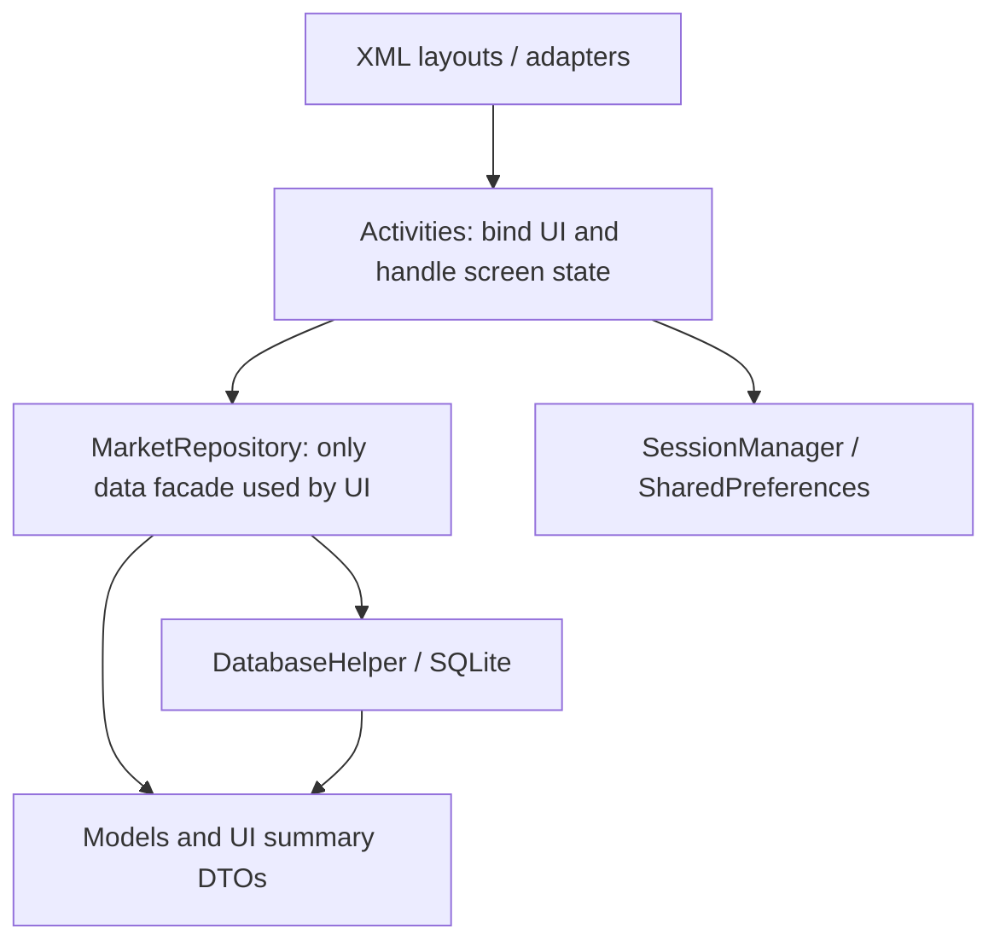
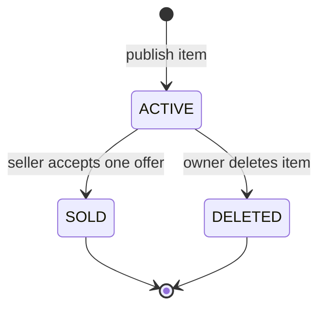
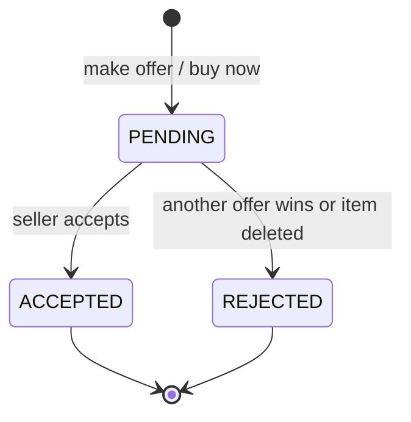
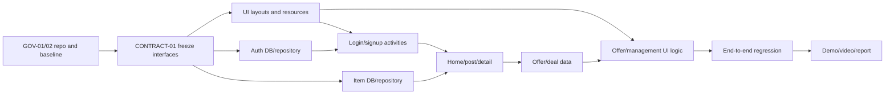

# HKU Campus Market：COMP7506D 小组项目总开发计划

> 文档状态：唯一有效开发基线（Single Source of Truth）
> 版本：1.4
> 最后更新：2026-07-21
> Android 工程：`E:\7506_project\Android_Studio_files`
> 适用对象：4 人小组、Codex/其他代码 Agent、代码审查者、测试与演示负责人

---

## 0. 如何使用这份计划

这份文档合并并取代此前的课程/PRD 分析、MVP 范围、架构计划、Vibe Coding 工作流、开源项目参考及 Agent 开发规范。旧文档只作为历史记录，不再作为开发决策依据。

所有成员和 Agent 开始工作前必须遵守以下顺序：

1. 阅读本文件的第 1 至 9 节，理解范围、架构和固定契约。
2. 从第 12 节任务清单中领取一个有明确编号的任务，例如 `AUTH-03`。
3. 检查该任务的前置任务是否已经合并到 `main`。
4. 创建独立短分支，只修改任务允许的文件范围。
5. 按第 15 节的 Agent Prompt 模板交给 Codex 实现。
6. 完成编译、测试、人工验收和自查后提交 Pull Request。
7. 由当日集成人确认契约未被破坏、主流程仍能运行后再合并。

本项目禁止用一句“把整个 App 写完”同时生成全部代码。每次只实现一个可验收的小闭环，以减少多人和多个 Agent 生成结果互相冲突的问题。

---

## 1. 项目结论与复杂度边界

### 1.1 课程要求摘要

课程要求从零开发一个智能手机应用，允许使用 Android Studio。小组最多 6 人，应用复杂度应与人数匹配。你们是 4 人小组，适合完成一个业务闭环完整、架构清楚、可稳定演示的中等复杂度 Android App。

课程提交重点：

| 项目 | 要求/权重 |
|---|---|
| App demonstration / sharing | 5% |
| Document file | 15%，至少 2 页，含至少 3 个相似 App 的背景研究、App 总结、成员贡献 |
| Introductory video | 15%，1-2 分钟 |
| Source code | 5%，附清楚的 README |
| 课堂演示日期 | 2026-07-25 |
| 最终提交截止 | 2026-08-02 23:59 |

评分重点并不是代码行数，而是研究、产品设计、完整流程、演示稳定性、文档和视频表达。开发策略必须先保证 P0 闭环，再做视觉和功能增强。

### 1.2 推荐产品定位

暂定名称：**HKU Campus Market**（也可在提交前统一改为 HKU Swap）。

一句话定位：

> A lightweight campus marketplace for HKU students to post items, make offers, confirm deals, and exchange WhatsApp contacts for on-campus handover.

主要差异：

- 比闲鱼和 Carousell 更轻量，减少广告、物流和复杂电商功能。
- 比 Facebook Marketplace 更聚焦 HKU 校园场景和线下面交。
- 只有成交双方可以在成交后看到对方 WhatsApp 联系方式。
- 商品成交后自动从公开列表下架，降低无效沟通。
- 管理中心同时覆盖卖家发布与买家参与两个视角。

### 1.3 复杂度结论

推荐实现“本地 SQLite 版校园二手交易平台”，包含：

- 7 个主要页面。
- 4 张核心数据库表。
- 注册登录、发布、搜索、详情、出价、卖家确认、成交、联系方式交换的完整状态流。
- 一台模拟器上通过退出/登录切换 Alice 和 Bob，即可演示买卖双方。
- Java + XML + SQLiteOpenHelper + SharedPreferences，不依赖远程服务。

这个范围足以体现 4 人工作量、数据库关系、状态机、CRUD、列表 UI 和完整用户故事，同时能在紧迫时间内稳定完成。

### 1.4 明确不做

以下内容只写入 final report 的 Future Work，不进入 P0：

- Firebase、云服务器、跨设备同步。
- 实时聊天、推送通知。
- 在线支付、押金、物流。
- HKU 邮箱真实验证、真实身份认证。
- 地图和定位。
- 推荐算法、信用评分、举报和管理员后台。
- 复杂动画或多套主题。

任何成员或 Agent 不得自行把 P2 功能加入工程。范围变化必须先更新本计划并由小组确认。

---

## 2. 功能范围与验收主流程

### 2.1 P0：必须完成

1. 注册：昵称、密码、WhatsApp；昵称大小写不敏感且唯一。
2. 登录与退出：本地验证；SharedPreferences 保存当前登录用户 ID。
3. 首页：展示所有 `ACTIVE` 商品，支持名称/描述关键字搜索。
4. 发布/编辑商品：名称、描述、价格、分类、相册图片；图片可为空并显示默认图。
5. 商品详情：展示图片、商品信息和卖家；根据当前用户身份显示卖家或买家操作。
6. 买家操作：Make Offer 和 Buy Now。
7. 卖家操作：编辑、软删除、查看报价、接受报价。
8. 管理中心：`My Listings` 和 `My Activity` 两个 Tab。
9. 成交：接受报价后创建交易、商品变 `SOLD`、其他报价变 `REJECTED`。
10. 联系方式：只有成交买卖双方可在管理中心看到对方 WhatsApp。
11. 持久化：App 重启后账号、商品、报价和成交记录仍存在。

### 2.2 P1：P0 稳定后再做

- 商品分类：Books、Electronics、Furniture、Daily Goods、Others。
- 分类筛选和价格排序。
- 全部页面的空状态、加载状态和明确错误提示。
- 图片 URI 长期权限与默认占位图。
- Demo seed data，只在 debug 构建或隐藏入口中提供。
- 视觉统一、无障碍标签、输入法和返回栈优化。

### 2.3 P2：只记录，不开发

Firebase、聊天、通知、支付、地图、评分、举报、推荐、管理员后台。

### 2.4 MVP 成功标准

下列脚本必须从头到尾一次跑通：

1. 注册/登录卖家 Alice。
2. Alice 发布一件二手教材。
3. 首页立即显示该商品。
4. Alice 退出，登录买家 Bob。
5. Bob 搜索教材并进入详情。
6. Bob 提交报价或 Buy Now。
7. Bob 的 `My Activity` 显示 `Pending`。
8. 切换回 Alice，在 `My Listings` 查看并接受 Bob 的报价。
9. 商品从首页消失。
10. 切换回 Bob，`My Activity` 显示 `Deal confirmed` 和 Alice 的 WhatsApp。
11. 关闭并重开 App，数据和登录状态仍正确。

---

## 3. 技术栈与工程原则

### 3.1 固定技术栈

| 层 | 选择 |
|---|---|
| IDE | Android Studio |
| 语言 | Java 11 |
| UI | XML + AppCompat + Material Components |
| 最低 SDK | 24 |
| 数据库 | SQLiteOpenHelper |
| Session | SharedPreferences，只存当前 userId |
| 列表 | RecyclerView；需要新增官方 AndroidX RecyclerView 依赖 |
| 图片 | `ACTION_OPEN_DOCUMENT`，数据库保存持久化 URI 字符串 |
| 测试 | JUnit 4 + AndroidX Instrumentation + Espresso |
| 构建 | Gradle Kotlin DSL，保留现有工程配置 |

### 3.2 核心原则

- UI 层不得直接拼 SQL 或操作 Cursor。
- 所有数据访问只能经过 `MarketRepository`。
- Activity 负责页面状态和用户操作，不负责数据库表细节。
- `DatabaseHelper` 只负责建表、升级和底层 SQL，不直接操作 View。
- 所有状态和值使用常量，禁止散落字符串，例如不得在多个文件手写 `"SOLD"`。
- 金额以 `long priceCents` 保存，避免 `double` 精度问题；界面统一用 `MoneyFormatter` 转换。
- 删除商品采用软删除 `DELETED`，不物理删除数据库记录。
- 接受报价必须在一个 SQLite transaction 中完成，任何一步失败则整体回滚。
- UI 文本放到 `res/values/*.xml`，禁止在 Java 和 layout 中散落可见硬编码文本。
- P0 阶段不引入额外架构框架、网络库、依赖注入或 Firebase。

### 3.3 当前工程状态

截至 2026-07-20，Phase 0 工程基础已经完成；远程 `main` 上的首批业务实现也已拉取并进入接收审查：

- 包名：`com.example.a7506_project`
- Java 11、minSdk 24、targetSdk 36。
- 已有 AppCompat、Material、ConstraintLayout、JUnit、Espresso。
- 已加入官方 AndroidX RecyclerView 1.4.0。
- 已创建冻结的数据模型、Repository 接口、状态/数据库常量和结果类型。
- 已创建全部 Activity/XML 页面骨架、固定 View ID、Manifest 注册和 Session 启动路由。
- 本地 Git `main` 仓库、根目录 `.gitignore`、PR 模板和任务 Issue 模板已建立。
- GitHub remote 已配置为 `https://github.com/zigeng22/hku-campus-market.git`，首次 push 已完成并验证本地与远程 `main` 一致。
- 本课程项目不启用 GitHub 强制 branch protection；分支与 PR 要求作为小组协作约定执行，降低四人小组的配置和维护成本。

Phase 0 验证记录：

| 项目 | 结果 |
|---|---|
| Gradle | 9.4.1 |
| Launcher JVM | Oracle JDK 17 |
| Gradle Daemon JVM | Java 21 toolchain |
| `assembleDebug` | PASS |
| `testDebugUnitTest` | PASS |
| `lintDebug` | PASS，0 errors；剩余 warning 为预建但尚未接 Adapter 的资源及刻意保留的 SDK/AGP 版本提示 |
| 固定 View ID 检查 | 63/63 present |

2026-07-20 远程实现接收记录：

| 项目 | 结果 |
|---|---|
| 接收提交 | `24c9050`：数据层、Activity 和 Adapter；`46bcd07`：队友完成报告 |
| `assembleDebug` | PASS |
| `testDebugUnitTest` | PASS，但只运行 1 个模板测试；业务测试仍为 0 |
| `lintDebug` | PASS，0 errors、17 warnings |
| 设备/E2E | 当前无在线模拟器或设备，未独立验证 Alice/Bob 主流程 |
| 接收结论 | 代码已形成大范围可编译实现，但存在业务与契约缺口；相关任务先标记 `IN PROGRESS`，修复并补测试后才能改为 `DONE` |

为降低风险，P0 不修改 applicationId 和 namespace。App 显示名称可以改，包名在最终提交后也无需再改。

---

## 4. 总体架构



建议目录：

```text
Android_Studio_files/app/src/main/
  java/com/example/a7506_project/
    MainActivity.java
    contract/
      AppContract.java
      DatabaseContract.java
    data/
      DatabaseHelper.java
      MarketRepository.java
      RepositoryProvider.java
    model/
      User.java
      Item.java
      Offer.java
      TradeTransaction.java
      ItemDraft.java
      ItemCard.java
      OfferSummary.java
      ParticipationSummary.java
      SortOrder.java
      result/
        RegistrationResult.java
        PlaceOfferResult.java
        AcceptOfferResult.java
    ui/
      auth/
        LoginActivity.java
        SignUpActivity.java
      home/
        HomeActivity.java
        ItemAdapter.java
      item/
        PostEditItemActivity.java
        ItemDetailActivity.java
      management/
        ManagementActivity.java
        ListingAdapter.java
        ParticipationAdapter.java
        OfferReviewActivity.java
        OfferAdapter.java
    util/
      SessionManager.java
      Validators.java
      MoneyFormatter.java
      PasswordHasher.java
  res/
    layout/
    drawable/
    values/
      strings.xml
      strings_auth.xml
      strings_items.xml
      strings_trade.xml
      colors.xml
      themes.xml
      dimens.xml
```

说明：

- `MainActivity` 只作为启动路由，不承载主页功能。
- `RepositoryProvider` 在 P0 中返回应用级单例 `MarketRepository`，便于 Activity 使用相同数据库入口。
- 不建立“每张表一个 Repository”；这个项目规模下，一个业务外观类更容易统一事务。
- UI Summary DTO 用于一次查询直接得到页面需要的信息，避免 Activity 再做 N+1 查询。

---

## 5. 冻结契约：多人并行开发的连接点

这一节是多人能否顺利合并的关键。`CONTRACT-01` 合并后即冻结；任何修改都必须单独提交 `contract-change` PR，并同时更新调用方和本文件。

### 5.1 全局常量

`AppContract.java` 至少包含：

```java
public static final String EXTRA_ITEM_ID = "extra_item_id";
public static final String EXTRA_EDIT_MODE = "extra_edit_mode";
public static final long INVALID_ID = -1L;

public static final String ITEM_ACTIVE = "ACTIVE";
public static final String ITEM_SOLD = "SOLD";
public static final String ITEM_DELETED = "DELETED";

public static final String OFFER_PENDING = "PENDING";
public static final String OFFER_ACCEPTED = "ACCEPTED";
public static final String OFFER_REJECTED = "REJECTED";

public static final String OFFER_TYPE_NEGOTIATED = "NEGOTIATED";
public static final String OFFER_TYPE_BUY_NOW = "BUY_NOW";
```

页面之间只传 ID，不传完整可变对象。目标页面通过 Repository 按 ID 重新读取最新状态。

### 5.2 Java 模型字段

| 类 | 必需字段 |
|---|---|
| `User` | `long id`, `String nickname`, `String whatsapp`, `long createdAt` |
| `Item` | `long id`, `long sellerId`, `String name`, `String description`, `long priceCents`, `String imageUri`, `String category`, `String status`, `long createdAt`, `long updatedAt` |
| `Offer` | `long id`, `long itemId`, `long buyerId`, `long amountCents`, `String type`, `String status`, `long createdAt`, `long updatedAt` |
| `TradeTransaction` | `long id`, `long itemId`, `long sellerId`, `long buyerId`, `long offerId`, `long finalPriceCents`, `long createdAt` |
| `ItemDraft` | 发布/编辑表单需要的 name、description、priceCents、imageUri、category |
| `ItemCard` | 首页卡片需要的 itemId、name、price、imageUri、category、sellerNickname |
| `OfferSummary` | 报价审核需要的 offerId、itemId、buyerNickname、buyerId、amount、type、status、createdAt |
| `ParticipationSummary` | 买家活动需要的 itemId、itemName、offerAmount、offerStatus、dealStatus、counterpartyWhatsApp |

模型只保存数据，不持有 Activity/Context，不执行 SQL。

### 5.3 `MarketRepository` 公共方法

方法命名和参数在 `CONTRACT-01` 冻结。实现成员可以增加私有方法，不得让 Activity 绕过这些方法。

```java
// Authentication
RegistrationResult registerUser(String nickname, String password, String whatsapp);
User authenticate(String nickname, String password);
User getUserById(long userId);

// Items
long createItem(long sellerId, ItemDraft draft);
boolean updateItem(long itemId, long sellerId, ItemDraft draft);
boolean softDeleteItem(long itemId, long sellerId);
Item getItemById(long itemId);
List<ItemCard> searchActiveItems(String keyword, String category, SortOrder sortOrder);
List<ItemCard> getListingsBySeller(long sellerId);

// Offers and deals
PlaceOfferResult placeOffer(long itemId, long buyerId, long amountCents, String offerType);
List<OfferSummary> getOffersForSellerItem(long itemId, long sellerId);
AcceptOfferResult acceptOffer(long offerId, long sellerId);
List<ParticipationSummary> getBuyerActivity(long buyerId);
TradeTransaction getTransactionForItem(long itemId);
```

统一结果类型必须包含 `success` 与稳定错误码，UI 根据错误码选择 string resource，不依赖数据库异常文本。建议错误码：

- `OK`
- `INVALID_INPUT`
- `DUPLICATE_NICKNAME`
- `INVALID_CREDENTIALS`
- `ITEM_NOT_FOUND`
- `ITEM_NOT_ACTIVE`
- `NOT_OWNER`
- `CANNOT_OFFER_OWN_ITEM`
- `DUPLICATE_PENDING_OFFER`
- `INVALID_PRICE`
- `OFFER_NOT_FOUND`
- `OFFER_NOT_PENDING`
- `DATABASE_ERROR`

### 5.4 Session 契约

`SessionManager` 只保存登录身份：

```java
void login(long userId);
void logout();
boolean isLoggedIn();
long getCurrentUserId();
```

规则：

- 不把密码、WhatsApp 或完整 User JSON 写入 SharedPreferences。
- App 启动时 `MainActivity` 根据 `isLoggedIn()` 跳转。
- 如果 session 中 userId 已不在数据库，清除 session 并返回登录页。
- 退出后清空返回栈，Back 不得回到登录前页面。

### 5.5 页面导航契约

| 来源 | 目标 | 参数 |
|---|---|---|
| `MainActivity` | Login 或 Home | 无 |
| Login | SignUp | 无 |
| Login/SignUp | Home | 登录成功后清空认证页面栈 |
| Home | ItemDetail | `EXTRA_ITEM_ID` |
| Home | PostEditItem | 新建时无 itemId |
| ItemDetail | PostEditItem | `EXTRA_ITEM_ID` + edit mode |
| Home | Management | 无，从 session 取用户 |
| ItemDetail/Management | OfferReview | `EXTRA_ITEM_ID` |

所有需要刷新数据的页面在 `onResume()` 重新查询。这样发布、编辑、删除或成交后返回上一页时无需复杂事件总线。

### 5.6 Layout 文件和固定 View ID

UI 成员必须先创建以下 ID；Java 功能成员只依赖这些 ID，不得各自发明第二套命名。

| Layout | 必需 ID |
|---|---|
| `activity_login.xml` | `inputNickname`, `inputPassword`, `buttonLogin`, `buttonOpenSignUp`, `progressLogin` |
| `activity_sign_up.xml` | `inputNickname`, `inputPassword`, `inputConfirmPassword`, `inputWhatsapp`, `buttonSignUp`, `buttonBackToLogin` |
| `activity_home.xml` | `toolbarHome`, `inputSearch`, `buttonClearSearch`, `recyclerItems`, `textEmptyItems`, `fabPostItem`, `fabManagement` |
| `activity_post_edit_item.xml` | `inputItemName`, `inputDescription`, `inputPrice`, `dropdownCategory`, `imagePreview`, `buttonChooseImage`, `buttonSaveItem` |
| `activity_item_detail.xml` | `imageItem`, `textItemName`, `textItemPrice`, `textItemCategory`, `textItemDescription`, `textSellerName`, `groupBuyerActions`, `groupSellerActions`, `buttonMakeOffer`, `buttonBuyNow`, `buttonEditItem`, `buttonDeleteItem`, `buttonViewOffers` |
| `dialog_make_offer.xml` | `inputOfferAmount` |
| `activity_management.xml` | `toolbarManagement`, `tabManagement`, `recyclerManagement`, `textEmptyManagement` |
| `activity_offer_review.xml` | `toolbarOffers`, `recyclerOffers`, `textEmptyOffers` |
| `row_item.xml` | `imageItemThumbnail`, `textRowItemName`, `textRowItemPrice`, `textRowItemCategory`, `textRowSeller` |
| `row_listing.xml` | `imageListing`, `textListingName`, `textListingPrice`, `textListingStatus`, `textOfferCount` |
| `row_offer.xml` | `textBuyerName`, `textOfferAmount`, `textOfferType`, `textOfferStatus`, `buttonAcceptOffer` |
| `row_participation.xml` | `textParticipationItem`, `textParticipationAmount`, `textParticipationStatus`, `textCounterpartyWhatsapp` |

如需修改 ID，必须先在对应任务 PR 中同时修改所有调用点，不能只改 XML 或只改 Java。

---

## 6. 数据库规范

### 6.1 Schema v1

#### `users`

| 字段 | 类型与约束 |
|---|---|
| `id` | INTEGER PRIMARY KEY AUTOINCREMENT |
| `nickname` | TEXT COLLATE NOCASE UNIQUE NOT NULL |
| `password_hash` | TEXT NOT NULL |
| `password_salt` | TEXT NOT NULL |
| `whatsapp` | TEXT NOT NULL |
| `created_at` | INTEGER NOT NULL |

密码不得明文保存。P0 使用标准 Java API 生成随机 salt，并使用 Android API 24 可用的 `PBKDF2WithHmacSHA1` 做派生；迭代次数作为单一常量保存。报告中说明这是本地教学 Demo，并非生产级身份系统。

#### `items`

| 字段 | 类型与约束 |
|---|---|
| `id` | INTEGER PRIMARY KEY AUTOINCREMENT |
| `seller_id` | INTEGER NOT NULL，FK users(id) |
| `name` | TEXT NOT NULL |
| `description` | TEXT NOT NULL |
| `price_cents` | INTEGER NOT NULL CHECK > 0 |
| `image_uri` | TEXT，可空 |
| `category` | TEXT NOT NULL |
| `status` | TEXT NOT NULL |
| `created_at` | INTEGER NOT NULL |
| `updated_at` | INTEGER NOT NULL |

#### `offers`

| 字段 | 类型与约束 |
|---|---|
| `id` | INTEGER PRIMARY KEY AUTOINCREMENT |
| `item_id` | INTEGER NOT NULL，FK items(id) |
| `buyer_id` | INTEGER NOT NULL，FK users(id) |
| `amount_cents` | INTEGER NOT NULL CHECK > 0 |
| `type` | TEXT NOT NULL，NEGOTIATED/BUY_NOW |
| `status` | TEXT NOT NULL，PENDING/ACCEPTED/REJECTED |
| `created_at` | INTEGER NOT NULL |
| `updated_at` | INTEGER NOT NULL |

#### `trade_transactions`

| 字段 | 类型与约束 |
|---|---|
| `id` | INTEGER PRIMARY KEY AUTOINCREMENT |
| `item_id` | INTEGER UNIQUE NOT NULL，FK items(id) |
| `seller_id` | INTEGER NOT NULL，FK users(id) |
| `buyer_id` | INTEGER NOT NULL，FK users(id) |
| `offer_id` | INTEGER UNIQUE NOT NULL，FK offers(id) |
| `final_price_cents` | INTEGER NOT NULL CHECK > 0 |
| `created_at` | INTEGER NOT NULL |

### 6.2 索引

至少建立：

- `items(status, created_at)`：首页查询。
- `items(seller_id, status)`：卖家管理。
- `offers(item_id, status)`：商品报价审核。
- `offers(buyer_id, status)`：买家活动。
- `trade_transactions(buyer_id)` 和 `trade_transactions(seller_id)`：成交记录。

### 6.3 状态机





状态规则：

- `SOLD` 和 `DELETED` 都不可回到 `ACTIVE`。
- 只有商品所有者能编辑、删除、查看完整报价和接受报价。
- 只有非卖家能对 `ACTIVE` 商品报价。
- Buy Now 创建 `type=BUY_NOW`、金额等于当前标价的 `PENDING` 报价，仍由卖家确认。
- 同一买家对同一商品最多有一个 `PENDING` 报价；再次提交时 UI 提示已报价。
- 删除 ACTIVE 商品时，所有 PENDING 报价统一变为 REJECTED。

### 6.4 接受报价的原子事务

`acceptOffer()` 必须按顺序在同一个数据库 transaction 内执行：

1. 查询 offer，确认存在且为 `PENDING`。
2. 查询 item，确认存在、为 `ACTIVE`，且调用者是 seller。
3. 把目标 offer 更新为 `ACCEPTED`。
4. 把同 item 的其他 `PENDING` offer 更新为 `REJECTED`。
5. 把 item 更新为 `SOLD`。
6. 插入唯一 `trade_transactions` 记录。
7. 所有步骤成功才 `setTransactionSuccessful()`；否则回滚并返回稳定错误码。

这是全项目最重要的业务测试点，必须由两名成员交叉 review。

### 6.5 数据库升级规则

- `DATABASE_VERSION` 只由数据层任务负责人修改。
- Schema v1 合并后尽快冻结，避免演示前频繁清 App 数据。
- 需要新增字段时写明确 `onUpgrade` SQL，不允许无提示 `DROP TABLE`。
- 开发阶段确需重置模拟器数据时，由成员在 Android Studio 手动 Clear App Storage；Agent 不自动删除项目文件或用户资料。

---

## 7. 页面与交互规格

### 7.1 Login

- 输入昵称和密码。
- 登录按钮点击后先做空值校验，再调用 Repository。
- 错误凭证只显示统一错误，不暴露用户是否存在。
- 成功后保存 userId，跳转 Home 并清空认证返回栈。
- 提供注册入口。

### 7.2 Sign Up

- 昵称：trim 后 3-20 字符；允许字母、数字、空格、下划线；大小写不敏感唯一。
- 密码：至少 6 字符；二次输入必须一致。
- WhatsApp：允许 `+852`、`+86` 或纯数字，去除空格和短横线后长度 8-15。
- 注册成功后直接登录或返回登录页，项目只选择一种行为。推荐直接登录并进入 Home。

### 7.3 Home

- Toolbar 显示 App 名称、当前昵称、退出菜单。
- 搜索采用 300ms debounce 或点击键盘搜索；P0 也可用 TextWatcher 即时查询本地 SQLite。
- RecyclerView 按 `created_at DESC` 展示 ACTIVE 商品。
- 点击卡片打开 Item Detail。
- 两个 FAB 使用明确图标和 contentDescription：发布、管理。
- 无结果时显示空状态，隐藏 RecyclerView。

### 7.4 Post/Edit Item

- 新建和编辑复用同一个 Activity，通过 Intent extra 区分。
- 名称 2-60 字符；描述 5-500 字符；价格 > 0 且最多两位小数。
- 分类 P0 可默认为 Others，P1 完成下拉选择。
- 图片使用系统文档选择器，不申请宽泛存储权限。
- 选择图片后调用 `takePersistableUriPermission`；失败时仍允许保存并使用占位图。
- 编辑模式必须验证当前用户是 seller 且 item 仍为 ACTIVE。

### 7.5 Item Detail

- 每次 `onResume()` 重新查询 item。
- 商品不存在或已删除时显示提示并安全退出页面。
- 当前用户是 seller：只显示 Edit、Delete、View Offers。
- 当前用户不是 seller 且商品 ACTIVE：只显示 Make Offer、Buy Now。
- SOLD 商品不允许新操作。
- 删除必须有确认 Dialog。

### 7.6 Offer Review

- 只允许 seller 打开自己的商品报价。
- 显示买家昵称、金额、类型、状态和时间。
- 只有 PENDING 报价显示 Accept 按钮。
- 接受前再次确认；成功后页面刷新，其他报价显示 Rejected。

### 7.7 Management

- 使用 Material `TabLayout`，一个 RecyclerView 根据 Tab 切换 adapter/data，不额外引入 ViewPager2。
- `My Listings`：显示当前用户所有商品、状态、报价数；点击进入详情或报价审核。
- `My Activity`：显示当前用户对其他商品的报价/成交状态。
- 只有成交成功时显示对方 WhatsApp；Pending/Rejected 不显示。

### 7.8 视觉规范

- 视觉方向：安静、清晰、校园工具型，不做营销式首页。
- 主色可使用 HKU 风格的 burgundy，搭配 charcoal 中性色、绿色成功状态和红色错误状态，避免整页单一色相。
- Card 圆角不超过 8dp；页面 section 不包成层层卡片。
- 页面内标题使用紧凑字号，不使用夸张 hero 字体。
- 常用操作使用 Material 图标；所有图标按钮有 contentDescription/tooltip。
- 触控目标至少 48dp；正文保证对比度；文字不得与按钮重叠。
- 所有固定格式区域设置稳定尺寸或约束，列表内容变化不能让工具栏/FAB 跳动。
- 适配至少 360x800 手机和常见 1080p 模拟器；横屏不是 P0，但不得直接 crash。

---

## 8. 多人协作模型

不需要把任务永久绑定到具体姓名，但需要固定“工作流”和“文件所有权”。一个人可以在不同日期切换工作流，前提是同一时间同一文件只有一个负责人。

### 8.1 四条工作流

| 工作流 | 主要责任 | 默认文件范围 |
|---|---|---|
| Data/Auth | 数据库、Repository、模型、Session、注册登录逻辑 | `data/**`, `model/**`, `contract/**`, `util/SessionManager`, auth Java |
| Market/Trade Logic | 商品、搜索、详情、报价、成交和管理中心 Java 逻辑 | item/home/management 下的 Activity Java |
| UI/UX | XML、theme、颜色、drawable、页面和 row layout、视觉验收 | `res/**`、必要的 Adapter 展示绑定 |
| QA/Integration/Docs | 测试矩阵、回归、README、报告、演示数据、视频脚本、PR 集成 | `test/**`, `androidTest/**`, docs；共享文件由其协调 |

### 8.2 单一写入者文件

以下文件冲突率高，同一时刻必须只有一位明确负责人：

- `app/build.gradle.kts`
- `gradle/libs.versions.toml`
- `AndroidManifest.xml`
- `AppContract.java`
- `DatabaseContract.java`
- `DatabaseHelper.java`
- `MarketRepository.java`
- `AGENTS.md`
- 本总计划

其他成员需要修改时，在任务/PR 中提出，由当前负责人合并，不能各自在分支中长期改同一个共享文件。

### 8.3 UI 与逻辑如何并行而不脱节

1. 先合并 `CONTRACT-01`：固定模型、Repository 方法、Intent extra、layout 名称和 View ID。
2. UI 工作流创建 XML 与资源，只使用固定 ID，不写业务 SQL。
3. Data 工作流实现 Repository；可先写纯数据测试，不依赖最终 UI。
4. Market/Trade 工作流按固定 ID 写 Activity Java，数据未完成时只在独立开发分支使用临时假数据。
5. 假数据不得合并到 `main` 的 release 流程；最终由 `RepositoryProvider` 接真实实现。
6. 每个里程碑末进行一次集成，不积累到最后一天一次性合并。

### 8.4 Git/GitHub 工作方式

- 仓库不要求配置 GitHub branch protection/ruleset；以下规则由组员共同遵守并由当日集成人检查。
- `main`：必须始终可编译，禁止直接开发。
- 分支命名：`feat/AUTH-03-login-flow`、`fix/TRADE-05-atomic-accept`、`docs/DOC-02-report`。
- 一个分支只处理一个任务编号；如果任务过大，先拆任务。
- Commit 示例：`AUTH-03 implement local login and session routing`。
- 每个 PR 必须写：任务编号、改动范围、测试命令、人工验证步骤、未完成内容、截图（UI 任务）。
- PR 合并前必须更新到最新 main 并解决冲突，合并后由集成人再次执行构建。
- 禁止把 Android Studio 的 `.idea/workspace.xml`、`local.properties`、build 输出或个人密钥提交。
- 不建议多人同时使用同一个本地工作目录。每位成员使用自己的 clone/branch；同一台电脑并行 Agent 应使用独立 Git worktree 或依次执行。

### 8.5 推荐合并顺序

同一功能纵向切片按以下顺序进入 main：

1. 契约和模型。
2. Layout/View ID 和 string resources。
3. Database/Repository 实现及测试。
4. Activity Java 和 Adapter 连接。
5. UI polish 和 Espresso/人工回归。

UI 与数据可并行开发，但二者都必须基于同一版契约。

---

## 9. Agent 管理制度

把 Codex 当作能够执行明确任务的工程师，而不是替小组做所有产品决策的黑盒。每次任务必须有主管式输入和可验证输出。

### 9.1 Agent 开工前检查

Agent 必须：

1. 阅读根目录 `AGENTS.md`。
2. 阅读本计划中与任务有关的章节。
3. 执行 `git status`，确认不覆盖用户已有修改。
4. 阅读将要修改的 Java、XML、Gradle 文件。
5. 复述任务边界和验收标准；小任务可直接实现，大任务先给 3-6 步计划。
6. 不修改任务范围外文件，除非编译所必需，并在结果中说明。

### 9.2 Agent 完工必须输出

- 完成的任务编号和功能。
- 修改/新增文件清单。
- 运行过的构建或测试及结果。
- 模拟器人工验证步骤。
- 仍存在的风险或未完成项。
- 是否修改了冻结契约；正常答案应为“否”。

### 9.3 禁止行为

- 一次要求 Agent 实现整个 App。
- 未读现有代码就重写文件。
- 为解决小问题擅自改成 Kotlin/Compose/Firebase。
- 在 Activity 中直接写 SQL。
- 用新的 View ID 绕过既定 layout 契约。
- 删除或覆盖其他成员未合并的工作。
- 为“修编译”而批量删除目录、缓存或用户资料。
- 未编译就宣布完成。
- 看到测试失败后直接删除测试。

### 9.4 Agent 之间的交接格式

每个任务建立简短交接记录，可放在 PR 描述：

```text
Task: ITEM-04
Based on main commit: <hash>
Contract version: 1.0
Files changed: ...
Public behavior added: ...
Build/tests: ...
Manual checks: ...
Known limitations: ...
Next unblocked tasks: ITEM-05, UI-06
```

后续 Agent 首先读交接和 diff，再继续工作，避免重复生成同一模块。

---

## 10. Definition of Ready / Definition of Done

### 10.1 任务可开工（Ready）

一个任务只有满足以下条件才能领取：

- 有唯一任务编号。
- 目标、非目标、输入和输出清楚。
- 所有依赖任务已合并，或提供了明确 mock 契约。
- 允许修改的目录/文件明确。
- View ID、模型字段、Repository 方法等接口已确认。
- 有至少一条可执行验收路径。

### 10.2 任务完成（Done）

- 代码符合 Java + XML 和分层规范。
- 没有新增编译 warning 中的明显错误、未使用占位 TODO 或硬编码敏感信息。
- `gradlew.bat assembleDebug` 成功。
- 相关 unit/instrumented tests 通过；无法运行的测试要说明原因。
- `git diff --check` 无空白错误。
- 正常路径、空数据、非法输入、返回栈至少人工检查一次。
- UI 任务提供 360x800 与常用模拟器截图并检查无重叠/截断。
- 没有修改任务外冻结契约。
- PR 描述和交接记录完整。

### 10.3 里程碑完成（Milestone Done）

- 从干净安装或已说明的 seed data 状态可重复演示。
- 两名不同成员完成交叉检查。
- main 在合并后重新构建成功。
- 主流程没有 crash、ANR 或必须重启才能恢复的状态。
- 本计划任务状态与实际一致。

---

## 11. 依赖关系与关键路径



关键路径是：契约冻结 → Auth → Item 主流程 → Offer 原子成交 → E2E。分类筛选、动画和视觉打磨都不能阻塞关键路径。

---

## 12. 完整任务清单

状态约定：`TODO`、`IN PROGRESS`、`BLOCKED`、`DONE`。开始任务时只修改该任务状态，不要一次标记一批未验证任务为完成。

### Phase 0：项目治理与契约（必须最先完成）

| ID | 状态 | 任务 | 依赖 | 交付物与验收 |
|---|---|---|---|---|
| GOV-01 | DONE | 建立 Git 仓库、远程仓库和轻量协作规则 | 无 | 本地/远程 `main`、`.gitignore` 和首次 push 已完成；经小组决策不启用强制 branch protection，使用分支、PR 和集成人检查约定 |
| GOV-02 | DONE | 建立基线构建记录 | 无 | 当前空项目 `assembleDebug` 成功，记录 JDK/Android SDK/模拟器版本 |
| GOV-03 | DONE | 建立任务看板和 PR 模板 | GOV-01 | 主计划任务表作为基线看板；GitHub PR/Issue 模板已建立 |
| CONTRACT-01 | DONE | 创建模型、AppContract、Repository 公共签名和结果码 | GOV-02 | 所有 Java stub 可编译；字段/签名与第 5 节一致 |
| CONTRACT-02 | DONE | 创建页面 XML skeleton 与固定 View ID | CONTRACT-01 | 所有 layout 编译成功；固定 View ID 63/63 存在 |
| ARCH-01 | DONE | 添加 RecyclerView 依赖并创建 package 结构 | GOV-02 | Gradle sync 和 assembleDebug 成功，只增加官方 RecyclerView 1.4.0 |
| ARCH-02 | DONE | 注册全部 Activity 与启动路由 skeleton | CONTRACT-02, ARCH-01 | 未登录到 Login；临时预览可到 Home；页面导航和返回栈可编译 |

### Phase 1：设计系统与认证

| ID | 状态 | 任务 | 依赖 | 交付物与验收 |
|---|---|---|---|---|
| UI-01 | DONE | 统一颜色、字体层级、间距、按钮和输入框风格 | CONTRACT-02 | 2026-07-20 完成 HKU Campus Editorial 色板、日夜主题、8dp 组件样式和尺寸 token；API 36 模拟器 360x800 与 411x914 日/夜模式截图验收通过，无重叠、截断或系统栏对比度问题；assemble/test/lint/diff-check 通过 |
| UI-02 | DONE | 完成 Login/Sign Up XML | CONTRACT-02, UI-01 | 原创校园 hero、响应式滚动表单、密码隐藏/切换、Autofill、loading 和稳定字段错误区已完成；360x800 实测文本/数字键盘、IME Done、底部字段自动滚动、注册登录及日夜模式通过，固定契约 ID 未变 |
| AUTH-01 | IN PROGRESS | 实现 `users` schema、PasswordHasher、用户模型映射 | CONTRACT-01 | `24c9050` 已实现 schema、PBKDF2 和映射；待 Repository 测试及设备持久化验证 |
| AUTH-02 | IN PROGRESS | 实现 SessionManager 与 MainActivity 路由 | ARCH-02 | 登录状态和清栈已实现；失效 userId 尚未在启动路由中清除 |
| AUTH-03 | IN PROGRESS | 实现注册校验和唯一昵称 | AUTH-01, UI-02 | 注册与唯一昵称逻辑已实现；WhatsApp 非数字的字段级提示及重复插入异常处理待修复，测试缺失 |
| AUTH-04 | IN PROGRESS | 实现登录/退出流程 | AUTH-01, AUTH-02, UI-02 | 登录、退出和清栈代码已连接；待设备验证及 AUTH-02 失效 session 修复 |
| TEST-AUTH-01 | TODO | Validators/密码/Repository 认证测试 | AUTH-03, AUTH-04 | 覆盖成功、边界、重复昵称和错误凭证 |

### Phase 2：商品发布、首页和详情

| ID | 状态 | 任务 | 依赖 | 交付物与验收 |
|---|---|---|---|---|
| UI-03 | DONE | Home、row_item、空状态 XML | CONTRACT-02, UI-01 | 首页工具栏、搜索区、列表标题、商品卡片、空状态、双 FAB 和 RecyclerView 已完成；API 36 模拟器分别用空数据和真实商品在 360x800、411x914 及日/夜模式验收，文本、价格、类别、卖家和操作按钮无重叠或截断 |
| UI-04 | TODO | Post/Edit Item XML | CONTRACT-02, UI-01 | 表单可滚动；键盘不遮挡保存；图片占位稳定 |
| UI-05 | TODO | Item Detail XML 与买卖双方 action group | CONTRACT-02, UI-01 | 两组操作互斥；长标题/描述不溢出 |
| ITEM-01 | IN PROGRESS | 实现 items schema、索引和 Item 映射 | AUTH-01 | schema、FK 和映射已实现；缺少计划要求的复合索引/部分 CHECK 约束，待数据测试 |
| ITEM-02 | IN PROGRESS | 实现 create/update/softDelete/getItem | ITEM-01 | CRUD、owner 和 ACTIVE 条件已实现；待 Repository 权限、状态和异常路径测试 |
| ITEM-03 | IN PROGRESS | 实现 ACTIVE 搜索、seller listings 和 ItemCard 查询 | ITEM-01 | ACTIVE/name/category/sort 和 listings 已实现；搜索尚未覆盖 description |
| ITEM-04 | IN PROGRESS | 实现 HomeActivity 和 ItemAdapter | UI-03, ITEM-03, AUTH-04 | onResume、搜索、空状态和详情导航已连接；待 ITEM-03 修复及设备验收 |
| ITEM-05 | IN PROGRESS | 实现 PostEditItemActivity 表单与金额转换 | UI-04, ITEM-02 | 新建/编辑表单和金额转换已连接；待边界测试、设备验收及可见文本资源化 |
| ITEM-06 | IN PROGRESS | 实现相册选择和 URI 持久化 | ITEM-05 | `OpenDocument` 和持久权限已实现；不可读 URI/权限异常的占位图与防 crash 处理缺失 |
| ITEM-07 | IN PROGRESS | 实现 ItemDetailActivity 身份视图 | UI-05, ITEM-02 | seller/buyer action、编辑、删除和 offer 导航已连接；待状态与设备验收 |
| TEST-ITEM-01 | TODO | 商品 Repository 和金额/搜索测试 | ITEM-02, ITEM-03 | 覆盖 CRUD、owner 权限、状态过滤、空关键字和价格边界 |

### Phase 3：报价、成交与管理中心

| ID | 状态 | 任务 | 依赖 | 交付物与验收 |
|---|---|---|---|---|
| UI-06 | TODO | Make Offer Dialog 与 row_offer XML | UI-01, UI-05 | 金额输入、类型、状态和 Accept 布局清楚 |
| UI-07 | TODO | Management/Listing/Participation layouts | UI-01, CONTRACT-02 | 两个 Tab、三种 row、空状态和联系方式布局完整 |
| TRADE-01 | IN PROGRESS | 实现 offers/trade_transactions schema 与索引 | ITEM-01 | 两张表、FK、唯一交易和部分索引已实现；计划要求的查询索引/部分 CHECK 约束待补齐 |
| TRADE-02 | IN PROGRESS | 实现 placeOffer/Buy Now 规则 | TRADE-01, ITEM-02 | 2026-07-21 `fix/TRADE-02-buy-now-rules` 已在 Repository 校验 offer type，并强制 Buy Now 使用商品标价；`assembleDebug`、unit test、lint 及 Medium_Phone API 36 全部 11 个仪器测试通过，待 PR 审核合并后改为 DONE |
| TRADE-03 | IN PROGRESS | 在 ItemDetail 连接 Offer Dialog/Buy Now | UI-06, TRADE-02 | Offer/Buy Now 已连接；Buy Now 仍要求用户输入任意金额，须随 TRADE-02 修复 |
| TRADE-04 | IN PROGRESS | 实现 seller offer list 查询与 OfferReviewActivity | UI-06, TRADE-01 | seller 查询、列表和 Pending Accept 已实现；非 owner 只返回空列表，待明确拒绝反馈和测试 |
| TRADE-05 | IN PROGRESS | 实现原子 acceptOffer 事务 | TRADE-01, ITEM-02 | 六步 transaction 已实现且可编译；原子回滚、重复接受和权限测试尚未建立 |
| TRADE-06 | IN PROGRESS | 实现 My Listings 数据与列表交互 | UI-07, ITEM-03, TRADE-04 | 状态、报价数和详情导航已实现；`ItemCard` 被未授权扩展 status/offerCount，需单独处理契约一致性 |
| TRADE-07 | DONE | 实现 My Activity 和成交联系人查询 | UI-07, TRADE-05 | PR #3 已于 2026-07-21 合并到 `main`（merge `ae6f7ac`）；按 accepted offer 精确匹配 transaction，Pending/Rejected 隐藏联系方式；真实 SQLite 双买家测试和 Adapter 复用测试共 4 个仪器测试通过 |
| TRADE-08 | IN PROGRESS | 完成 ManagementActivity Tab 切换 | TRADE-06, TRADE-07 | Tab、Adapter 切换和 onResume 已实现，TRADE-07 blocker 已清除；待 TRADE-06 契约处理及设备回归 |
| TEST-TRADE-01 | IN PROGRESS | 报价规则测试 | TRADE-02 | `MarketRepositoryOfferRulesTest` 的 7 个用例已覆盖 Buy Now 固定标价、普通报价、非法类型/金额、自购、重复 Pending 和非 ACTIVE；Medium_Phone API 36 执行通过，待 TRADE-02 PR 合并后改为 DONE |
| TEST-TRADE-02 | TODO | 原子成交和权限测试 | TRADE-05, TRADE-07 | 一笔 ACCEPTED、一笔 transaction、其余 REJECTED、item SOLD；失败时无半成品 |

### Phase 4：集成、稳定性和视觉收尾

| ID | 状态 | 任务 | 依赖 | 交付物与验收 |
|---|---|---|---|---|
| INT-01 | TODO | 从干净安装跑 Alice/Bob 完整主流程 | Phase 1-3 | 第 2.4 节 11 步一次成功，记录缺陷 |
| INT-02 | TODO | 修复 Activity 生命周期、返回栈和 onResume 刷新 | INT-01 | 旋转/后台恢复不 crash；成交后旧页面不显示可购买状态 |
| INT-03 | TODO | 统一错误、空状态和 Snackbar/Dialog 行为 | INT-01 | 无数据库异常文本泄露；错误消息可理解 |
| UI-08 | TODO | 视觉一致性和响应式检查 | INT-01 | 两种手机尺寸截图无重叠、截断、不可点击控件 |
| QA-01 | TODO | 全量手工测试矩阵 | INT-01 | 第 14 节所有 P0 用例有 Pass/Fail 与修复链接 |
| QA-02 | TODO | 单元/仪器测试回归和完整构建 | QA-01 | assembleDebug、testDebugUnitTest、connectedDebugAndroidTest（有设备时）结果记录 |
| DEMO-01 | TODO | Seed demo data 或稳定测试账号方案 | INT-01 | 不污染正式流程；可在 30 秒内准备 Alice/Bob 场景 |
| FREEZE-01 | TODO | Demo 前代码冻结 | QA-02, UI-08 | 只允许 blocker fix；打 `demo-v1` tag；保留可安装 APK |

### Phase 5：课程交付

| ID | 状态 | 任务 | 依赖 | 交付物与验收 |
|---|---|---|---|---|
| DOC-01 | TODO | README | INT-01 | 项目介绍、环境、构建运行、架构、功能、限制、开源归属齐全 |
| DOC-02 | TODO | Final report | INT-01 | 至少 2 页；3 个竞品研究、设计、架构、测试、成员贡献、future work |
| DOC-03 | TODO | 开源/素材 attribution 审计 | DOC-01 | 每个复制/改编资源有 license 和来源；无不明代码 |
| VIDEO-01 | TODO | 1-2 分钟脚本和分镜 | INT-01 | 在时限内覆盖问题、核心流程、差异和结果 |
| VIDEO-02 | TODO | 录制、剪辑、复核 | VIDEO-01, FREEZE-01 | 字幕可读、无隐私信息、画面不卡顿、时长合规 |
| SUBMIT-01 | TODO | 最终提交检查 | DOC-02, DOC-03, VIDEO-02 | 文档、视频、source+README 均可打开；从提交包能构建 |

### 12.1 2026-07-20 队友实现接收审查

来源：`finekiss` 的提交 `24c9050` 和说明提交 `46bcd07`。`TASK_COMPLETION_REPORT.md` 保留为成员贡献记录，但任务状态只以本主计划和验收结果为准。

已确认的实现范围：

- 新增 `DatabaseHelper`、`MarketRepositoryImpl`、`RepositoryProvider`，建立 4 张表并实现全部 Repository 方法。
- 新增密码、校验和金额工具类。
- 连接 Login、Sign Up、Home、Post/Edit、Item Detail、Offer Review、Management 页面。
- 新增首页、卖家商品、报价和买家活动 4 个 RecyclerView Adapter。
- 工程可以编译，lint 无 error。

合并后必须优先处理的验收缺口：

1. `TRADE-07`：只允许 accepted offer 对应买家看到卖家 WhatsApp；Pending/Rejected 必须隐藏联系人，禁止显示示例号码。
2. `TRADE-02/03`：Buy Now 必须由 Repository 强制使用商品标价，UI 不允许提交任意金额。
3. `ITEM-03`：搜索同时覆盖 name 和 description，并补稳定排序测试。
4. `AUTH-02`：启动时验证 session userId 仍存在，不存在时清 session 回 Login。
5. `ITEM-06`：不可读/失效图片 URI 必须回退占位图且不得 crash。
6. `ITEM-01/TRADE-01`：按第 6 节核对 CHECK 约束和复合索引。
7. `TRADE-06/CONTRACT-01`：处理 `ItemCard` 新增 status/offerCount 的未授权冻结契约变更；不得继续扩散第二套模型。
8. `AUTH-03/INT-03`：补字段级校验、数据库异常映射，并把 Java/XML 中新增可见硬编码文本迁移到 string resources。
9. `TEST-AUTH-01`、`TEST-ITEM-01`、`TEST-TRADE-01/02`：当前业务测试为 0，必须在宣告功能完成前补齐。

在以上 blocker 修复并完成设备 E2E 前，`INT-01/02/03` 保持 `TODO`；不得仅依据个人完成报告改为 `DONE`。

### 12.2 2026-07-21 P0 修复执行基线

当前决定继续使用 `SQLiteOpenHelper` 本地数据库，不引入 Firebase、远程 API 或其他云端依赖。数据库、Repository 和 Activity 调用链保留；后续工作重点是修正规则、补齐异常路径和建立可重复验收证据。

后端与集成任务必须按以下顺序逐项关闭；前一项未通过测试时，不得把依赖它的后续任务标为 `DONE`：

| 顺序 | 任务 | 必须完成的具体内容 | 完成证据 |
|---|---|---|---|
| 1 | `TRADE-07` | `getBuyerActivity` 只按 accepted `offer_id` 关联 transaction；未成交报价不得得到联系方式；Adapter 无号码时隐藏控件且不显示示例号码 | 一件商品至少两个买家报价，只允许 accepted 买家看到卖家 WhatsApp；Repository 与 Adapter 测试通过 |
| 2 | `TRADE-02/03` | Repository 校验 offer type；`BUY_NOW` 金额强制等于当前商品标价；Buy Now UI 不再要求用户输入金额并提供确认反馈 | 普通报价仍可输入；篡改 Buy Now 金额也只能按标价保存；重复 Pending/自购/非 ACTIVE 均返回稳定错误码 |
| 3 | `AUTH-02` | 启动时用 Repository 验证 session userId；用户不存在时清 session 并进入 Login | 有效 session 进入 Home；伪造/失效 userId 自动退出；返回栈正确 |
| 4 | `ITEM-03` | 搜索同时覆盖 name 和 description；同价格/同时间结果增加稳定次级排序 | 名称、描述、大小写、空关键字、仅 ACTIVE 和排序边界测试通过 |
| 5 | `ITEM-06` | `takePersistableUriPermission`、预览和详情加载捕获失效/无权限 URI；统一回退占位图 | 空 URI、撤销权限、不可读 URI 均不 crash，发布和详情仍可使用 |
| 6 | `ITEM-01/TRADE-01` | 补价格/状态/type CHECK 与第 6.2 节复合索引；明确 schema v2 migration 或在冻结前执行一次受控数据重置 | `PRAGMA table_info/index_list` 与异常插入测试通过；升级路径有记录 |
| 7 | `TRADE-06/CONTRACT-01` | 正式决定 `ItemCard` 是否包含 status/offerCount；如保留扩展，先更新冻结契约和所有构造点，禁止继续隐式扩展 | 契约、模型、Repository 和 Adapter 一致，完整编译通过 |
| 8 | `AUTH-03/INT-03` | 统一 Activity 与 Validators 规则；昵称/WhatsApp/商品/金额错误落到字段；数据库异常映射稳定错误码；可见文本迁入 resources | 非法输入不触发 SQL；无 SQLite 异常文本泄露；字段错误和 loading 状态设备验收通过 |
| 9 | `TEST-AUTH-01/TEST-ITEM-01/TEST-TRADE-01/02` | 删除模板测试依赖，建立纯 Java 工具测试和 Android Repository/SQLite 仪器测试 | 第 14.2 节 A/I/T 用例有自动化覆盖或明确手工记录，`assembleDebug`、unit、connected tests 全部通过 |

UI 并行规则：

- `UI-04` 和 `UI-05` 可与顺序 1-5 并行，但只能使用冻结 View ID 和 Repository 接口，不得在 UI 中补 SQL 或复制业务规则。
- `UI-06` 在 `TRADE-02/03` 行为冻结后完成，明确区分可输入金额的 Make Offer 与固定标价的 Buy Now。
- `UI-07` 在 `TRADE-07` 和 `TRADE-06/CONTRACT-01` 通过后完成，避免按错误联系人和状态语义返工。
- `INT-01` Alice/Bob 11 步流程通过后再做 `UI-08` 全局视觉收尾；视觉优化不得掩盖未通过的业务状态。
- 每个修复任务使用独立分支和 PR；合并后由另一名成员按对应完成证据复核，再更新任务为 `DONE`。

---

## 13. 具体时间安排

按 2026-07-19 当前时间和 2026-07-25 课堂演示倒排：

| 日期 | 必须达到的结果 | 可并行工作 |
|---|---|---|
| 7 月 19 日 | GOV、ARCH、CONTRACT 完成并冻结；空工程可编译 | UI 建 skeleton；Data 建模型和 users schema |
| 7 月 20 日 | 注册、登录、退出、Session 全通 | UI 做 Home/Post/Detail；Data 开始 items |
| 7 月 21 日 | 发布、首页、搜索、详情全通 | UI 做 Management；Data 开始 offers/transaction |
| 7 月 22 日 | Make Offer、Buy Now、卖家接受、管理中心全通 | 测试成员开始 Auth/Item 回归 |
| 7 月 23 日 | Alice/Bob E2E 第一次完整跑通 | UI polish、修生命周期和权限缺陷 |
| 7 月 24 日 | 全量回归、Demo 数据、APK、`demo-v1` 冻结 | 课堂演示和彩排；只修 blocker |
| 7 月 25 日 | 课堂展示稳定版本 | 记录反馈，不在展示前临时加功能 |
| 7 月 26-30 日 | 根据反馈修复、补 P1、完成 report/README | 视频脚本和素材归属检查 |
| 7 月 31 日-8 月 1 日 | 录制最终视频、从干净提交包复建 | 两人独立复核所有文件 |
| 8 月 2 日 | 23:59 前提交，建议至少提前 6 小时 | 只处理提交阻塞问题 |

每天结束必须：main 构建一次、跑一次当日新增主流程、更新任务状态、列出第二天第一优先级。

---

## 14. 测试计划

### 14.1 自动化命令门禁

在 `Android_Studio_files` 下运行：

```powershell
.\gradlew.bat assembleDebug
.\gradlew.bat testDebugUnitTest
.\gradlew.bat connectedDebugAndroidTest
git diff --check
```

`connectedDebugAndroidTest` 只有在模拟器/设备在线时才要求执行；无法执行必须在 PR 中写明，而不是伪报通过。

### 14.2 P0 手工测试矩阵

| 编号 | 场景 | 预期结果 |
|---|---|---|
| A01 | 合法注册 | 创建账号并进入 Home |
| A02 | 重复昵称，大小写不同 | 拒绝注册并提示昵称已存在 |
| A03 | 密码不一致/太短 | 不调用数据库，显示字段错误 |
| A04 | 错误密码登录 | 留在 Login，显示统一错误 |
| A05 | 重启 App | 保持有效登录并进入 Home |
| A06 | Logout 后按 Back | 不返回 Home |
| I01 | 合法发布商品 | 首页立即可见，重启后仍存在 |
| I02 | 空名称/非法价格 | 不保存并定位错误字段 |
| I03 | 搜索名称和描述 | 大小写不敏感，只显示匹配 ACTIVE |
| I04 | 编辑自己的 ACTIVE 商品 | 首页/详情显示更新值 |
| I05 | 非 owner 尝试编辑 | Repository 拒绝，UI 不进入可编辑状态 |
| I06 | 删除商品 | 状态 DELETED，首页消失，记录保留 |
| I07 | 图片 URI 不可读 | 显示占位图，不 crash |
| T01 | 对自己商品报价 | 拒绝并提示 |
| T02 | 普通报价 | seller 可见，buyer Activity 显示 Pending |
| T03 | Buy Now | 创建等于标价的 BUY_NOW Pending 报价 |
| T04 | 同买家重复 Pending | 拒绝重复或按冻结规则处理，不产生两条 Pending |
| T05 | 非 seller 接受报价 | 拒绝，数据不变化 |
| T06 | seller 接受报价 | 目标 Accepted、item Sold、transaction 一条、其他 Pending Rejected |
| T07 | 重复接受 | 安全失败，不产生第二笔 transaction |
| T08 | 成交后首页搜索 | 商品不再出现 |
| T09 | 联系方式可见性 | 只对成交双方显示，其他状态不显示 |
| L01 | 空数据库打开所有页面 | 空状态正确，无 crash |
| L02 | 快速返回/重复点击 | 不产生重复提交，不打开错误页面 |
| L03 | App 进入后台后恢复 | 页面重新读取最新数据，不 crash |

### 14.3 UI 检查

- 360x800 与常用 Pixel 模拟器各检查一次。
- 系统字体 1.0x 和较大字体检查主要页面。
- 软键盘出现时保存按钮和输入字段可访问。
- 长商品名、500 字描述、长 WhatsApp 不覆盖其他控件。
- 列表空、有 1 项、有 20 项都不改变固定工具栏/FAB 布局。
- 图片为空、横图、竖图时使用统一 `centerCrop`/占位策略。
- 所有图标按钮有可访问说明，颜色不是状态的唯一表达。

---

## 15. Codex / Vibe Coding 标准 Prompt

### 15.1 主管分配任务 Prompt

```text
你是本项目的开发主管。请先阅读：
- E:\7506_project\AGENTS.md
- E:\7506_project\project_docs\7506_MASTER_DEVELOPMENT_PLAN.md
- E:\7506_project\Android_Studio_files 中的当前代码

本轮只处理任务 [TASK-ID]：[任务名称]。

目标：
[从任务表复制交付物]

前置条件：
[列出已合并依赖]

允许修改：
[明确目录/文件]

禁止修改：
- 冻结模型、Repository 方法、Intent extra 和 View ID；如确有冲突，先报告，不自行改变。
- 不处理其他任务，不加入 Firebase/Kotlin/Compose/远程后端。
- 不覆盖其他成员已有修改，不批量删除文件或目录。

执行方法：
1. 先检查 git status 并阅读相关文件。
2. 给出简短实施步骤，然后直接实现。
3. 运行最相关测试和 assembleDebug。
4. 检查 diff 是否只覆盖本任务。

完成标准：
[复制本任务验收条件 + 第 10.2 节]

最终报告必须包含：改动文件、测试结果、模拟器验证步骤、剩余风险、是否改动冻结契约。
```

### 15.2 UI Agent Prompt

```text
只完成 [UI-XX]。严格使用总计划第 5.6 节中的 layout 名称和 View ID。
使用 Java + XML 和现有 Material 依赖，不写数据库逻辑，不修改 Repository。
检查 360x800 和常用 Pixel 尺寸，保证文字不截断、控件不重叠、触控区域至少 48dp。
可见文本进入该功能自己的 strings_*.xml；提供页面空状态、错误状态和长文本状态。
完成后编译，并列出 Activity Java 可以直接绑定的全部 View ID。
```

### 15.3 数据层 Agent Prompt

```text
只完成 [AUTH/ITEM/TRADE-XX] 的数据库与 Repository 工作。
公共签名必须与总计划第 5.3 节一致；UI 不可直接访问 Cursor/SQLiteDatabase。
SQL 使用参数绑定；Cursor、数据库 transaction 必须正确关闭；金额使用 long cents。
对权限、状态和不存在数据返回稳定结果码，不把 SQLite exception 传给 UI。
为正常路径、非法输入、权限失败和状态冲突增加最小充分测试。
```

### 15.4 功能连接 Agent Prompt

```text
只完成 [TASK-ID] 的 Activity/Adapter 连接。
XML/View ID 已由 UI 契约确定，数据只能通过 MarketRepository，登录身份只能通过 SessionManager。
在 onResume 刷新可变数据；处理空数据、数据库失败、Activity 返回和重复点击。
不要修改数据库 schema 或公共 Repository 签名；发现缺口时报告 contract mismatch。
```

### 15.5 Review Agent Prompt

```text
请以代码审查方式检查任务 [TASK-ID] 的 diff，不要先重写。
按严重程度查找：业务状态错误、权限绕过、数据不一致、生命周期 crash、资源/URI 泄漏、UI ID 不匹配、缺失测试。
每个问题给出文件和行号、复现条件、影响和最小修复建议。
如果无问题，明确说明，并列出剩余测试风险。
```

### 15.6 Integration Agent Prompt

```text
当前目标是把 [PR/BRANCH A] 与 [PR/BRANCH B] 集成到最新 main。
先阅读双方交接记录和冻结契约，检查是否修改同一文件或同一接口。
只解决集成所需冲突，不顺便重构。
合并后运行 assembleDebug、相关测试，并按总计划第 2.4 节走主流程到本里程碑可达到的位置。
报告冲突如何解决、采用了哪一方行为、是否产生后续任务。
```

### 15.7 Crash 修复 Prompt

```text
复现步骤：[步骤]
预期结果：[结果]
实际结果：[结果]
设备/API：[信息]
Logcat 中从 FATAL EXCEPTION 开始的完整堆栈：[粘贴]

请先定位根因和影响范围，再做最小修复。不要删除失败测试，不要改动无关架构。
修复后增加能防止复发的测试或明确人工回归步骤，并运行 assembleDebug。
```

---

## 16. 开源项目与参考策略

### 16.1 总结

继续使用当前空 Android 工程从零实现最合适。不要以某个开源商城为完整基础框架，因为课程要求从零开发，而且旧项目的 Gradle/Firebase/Parse 迁移成本和许可风险可能高于自己实现。

可以把项目 clone 到独立 `reference_repos` 目录阅读，但禁止直接混入主工程。

### 16.2 可参考项目

| 项目 | 可参考内容 | 不采用原因/风险 |
|---|---|---|
| [birajsilwal/Online-marketplace](https://github.com/birajsilwal/Online-marketplace) | 校园 marketplace 页面流、RecyclerView 思路 | Parse/Heroku、项目较旧，不适合直接作为基础 |
| [NehalH/HomeGrown](https://github.com/NehalH/HomeGrown) | Java Android marketplace 的注册、listing、搜索、联系卖家流程 | 未确认 license；无公开稳定 APK/演示；只看结构不复制代码 |
| [abdulazeem-tk4vr/LIVEMart](https://github.com/abdulazeem-tk4vr/LIVEMart) | README、商品 CRUD、电商角色流程 | Firebase 和 grocery 电商复杂度过高，不能作为本项目底座 |
| [radualexandrub/Android-SQLite-Database-MultipleTables](https://github.com/radualexandrub/Android-SQLite-Database-MultipleTables) | Java、SQLiteOpenHelper、多表 CRUD 模式 | 业务不是 marketplace；只参考数据层写法 |

### 16.3 引用规则

- 先查看仓库 LICENSE；无明确 license 的代码不得复制。
- 只迁移确实需要的小片段，并记录 URL、commit、license、原文件、修改内容。
- final report 和 README 中列出所有第三方代码、图片、图标和素材。
- 相似 App 背景研究至少覆盖 3 个真实产品，建议闲鱼、Carousell、Facebook Marketplace；开源仓库不自动等同于竞品研究。
- 你们的核心流程、数据库 schema、页面结构和 HKU 差异必须由小组自己设计并能解释。

---

## 17. 风险登记与应对

| 风险 | 概率/影响 | 预防 | 触发后的处理 |
|---|---|---|---|
| 多人改同一文件导致冲突 | 高/高 | 单一写入者、短分支、固定契约 | 暂停新功能，由集成人基于最新 main 解决并重跑构建 |
| Agent 擅自改接口 | 中/高 | Prompt 写明冻结契约，PR 检查 public API | 拒绝 PR；必要时建立单独 contract-change 任务 |
| 接受报价产生半成品数据 | 中/高 | 单一 SQLite transaction + 测试 | 不手工修数据；修事务并重置 demo data |
| 图片重启后失效 | 中/中 | ACTION_OPEN_DOCUMENT + persistable permission + placeholder | 显示占位图，不阻塞交易流程 |
| Gradle/依赖下载失败 | 中/高 | 少依赖、提前基线构建、缓存依赖 | 不临时换框架；记录错误并使用现有官方依赖 |
| targetSdk/模拟器行为差异 | 中/中 | 固定测试设备/API，至少再测一个 API | 以课程演示设备为 blocker 优先级修复 |
| UI 完成但 Java 绑定不上 | 高/高 | 固定 layout/View ID；XML 先合并 | 按契约修实现，不同时发明第二套 ID |
| 时间不足 | 高/高 | P0/P1/P2 门禁，7 月 23 日 E2E | 立即冻结 P1，集中修主流程和演示 |
| 代码来源解释不清 | 中/高 | attribution 记录、无 license 不复制 | 重写相关片段或移除，更新 README/report |
| 演示账号/数据混乱 | 中/高 | 固定 seed/脚本，彩排三次 | 清 App Storage 后按脚本重建，不现场临时输入复杂数据 |

---

## 18. Demo、视频和最终文档计划

### 18.1 课堂 Demo 脚本

目标 90 秒：

1. 10 秒：一句话说明 HKU 校园二手交易痛点。
2. 20 秒：Alice 发布教材，首页显示。
3. 20 秒：切换 Bob，搜索并报价/Buy Now。
4. 20 秒：切回 Alice，接受报价。
5. 15 秒：Bob 查看成交和 WhatsApp，首页商品消失。
6. 5 秒：总结“local, lightweight, campus-focused”。

展示前关闭通知、固定模拟器尺寸、电量和网络状态；即使断网，核心流程仍应完整运行。

### 18.2 1-2 分钟视频

- 0:00-0:10：问题和目标用户。
- 0:10-0:25：与闲鱼/Carousell/Facebook Marketplace 的差异。
- 0:25-1:25：完整 Alice/Bob 主流程。
- 1:25-1:40：架构图、SQLite 多表和状态一致性亮点。
- 1:40-1:55：团队贡献与 Future Work。
- 预留 5 秒片尾和来源说明；总时长不超过课程要求。

### 18.3 Final report 结构

1. Problem background and target users。
2. Background research：至少 3 个相似 App。
3. Product goals and feature scope。
4. User flow and UI design。
5. Android architecture and database schema。
6. Key implementation：搜索、图片 URI、原子成交状态流。
7. Testing and limitations。
8. Individual contributions：按任务编号和 PR/commit 列出。
9. Future work。
10. References and open-source attribution。

### 18.4 README 必含内容

- App 简介和功能截图。
- 环境：Android Studio/JDK/SDK/Gradle。
- 打开、Sync、Build、Run 步骤。
- 推荐模拟器配置。
- 项目目录和架构说明。
- Demo 主流程。
- 当前限制：本地单设备、无真实身份/支付/聊天。
- 测试命令和结果。
- 小组成员贡献。
- License/第三方来源。

---

## 19. 最终提交检查清单

### 代码

- [ ] 从提交包解压后能在 Android Studio 打开并 Sync。
- [ ] `assembleDebug` 和 unit tests 成功。
- [ ] 无 `local.properties`、个人路径、密钥或账号隐私。
- [ ] 无无关 build 输出和大型临时文件。
- [ ] P0 主流程从干净数据可重复运行。
- [ ] README 与实际工程一致。

### 产品

- [ ] 两个账号可切换。
- [ ] ACTIVE/SOLD/DELETED 和 PENDING/ACCEPTED/REJECTED 行为一致。
- [ ] 成交后公开列表下架，双方联系方式可见。
- [ ] 空状态、错误输入、返回栈无明显问题。
- [ ] 两种手机尺寸没有文字/控件重叠。

### 课程材料

- [ ] Report 至少 2 页并包含 3 个竞品研究。
- [ ] 每名成员贡献可由任务/PR/commit 证明。
- [ ] 视频 1-2 分钟、可播放、声音和字幕清楚。
- [ ] Source code 包含 README。
- [ ] 开源代码和素材 attribution 完整。
- [ ] 在 2026-08-02 23:59 前完成上传并重新下载检查。

---

## 20. 当前立即执行任务

Phase 0 已完成。2026-07-20 已从 GitHub 拉取 `finekiss` 的首批业务实现；当前重点从“继续生成完整功能”切换为“审查、修复、测试和集成”。

按以下顺序执行，每次只向 Agent 分配一个任务 ID：

1. `TRADE-07`：已由 PR #3 合并并通过联系人隐私回归测试，状态为 `DONE`。
2. `TRADE-02`：当前分支已完成 Repository 固定 Buy Now 标价和 7 个规则测试；PR 合并后立即执行 `TRADE-03`，修正 Buy Now UI 流程。
3. `ITEM-03`：补 description 搜索与查询测试。
4. `AUTH-02`：补失效 session userId 的启动清理。
5. `ITEM-06`：补图片 URI 失效和权限异常回退。
6. `ITEM-01/TRADE-01`：核对 schema 约束和索引；如需升级 schema，建立明确 migration 决策。
7. `AUTH-03/INT-03`：统一校验、错误映射和 string resources。
8. `TEST-AUTH-01`、`TEST-ITEM-01`、`TEST-TRADE-01/02`：为上述实现建立回归保护。
9. `INT-01`：在模拟器上从清空 App Data 开始跑完整 Alice/Bob 流程并记录结果。

UI 成员可以并行处理 `UI-01` 至 `UI-07`，但不得修改 Repository、schema、冻结 View ID 或状态常量。其他成员不要再次生成整套数据库或全部 Activity；必须基于 `24c9050` 的现有代码做小范围、可验证修复。
